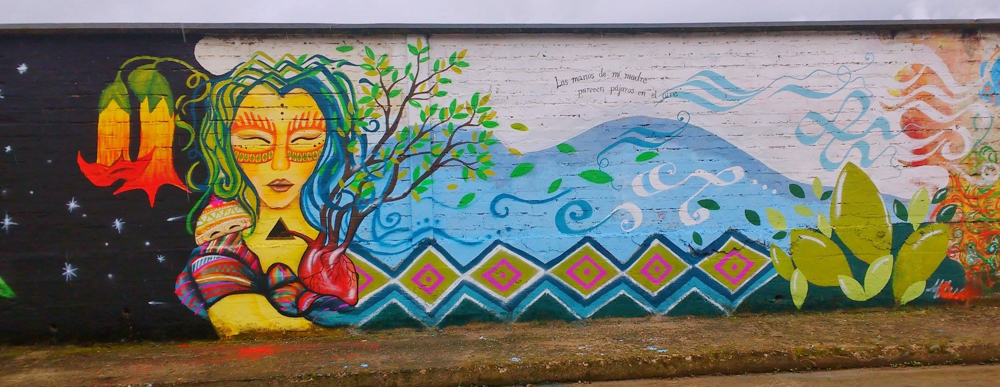
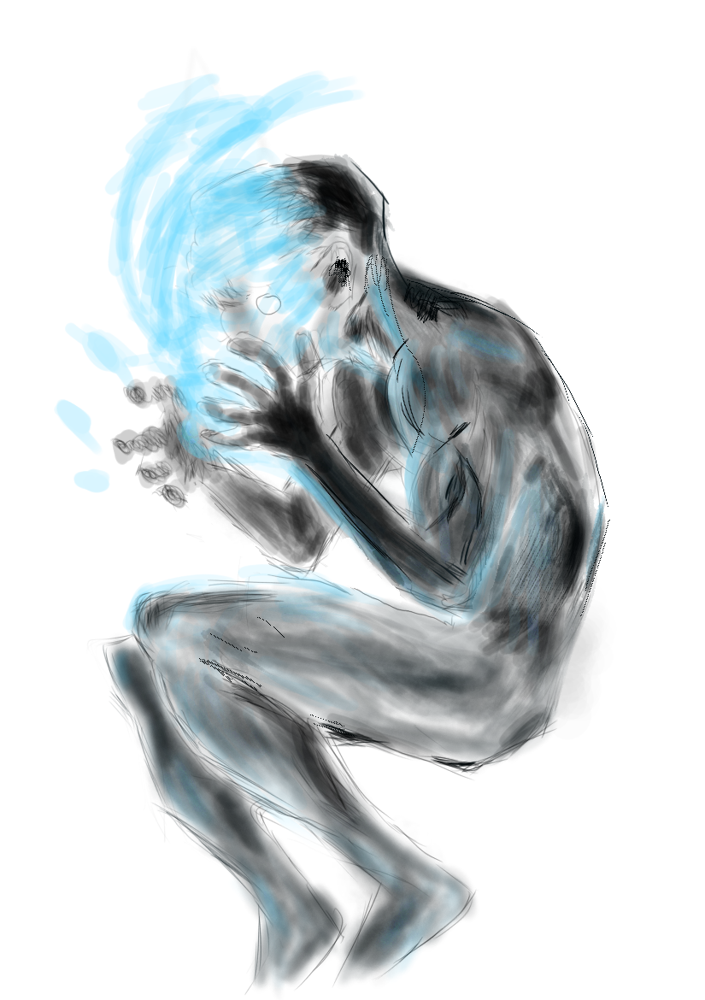

# Curriculum vitae #

## ¿Quien soy? ##

>Tengo la buena fortuna de haber nacido en el Putumayo, dentro de cuna campesina de llevar este amor por la madre tierra, de memorias, de saberes ancestrales.

__Nombre :__ Miller Ossa Samboni

__Correo :__ mikler.ossa@gmail.como

__Telefono :__ 3508987994

## ¿Qué hago ? ##
Tengo las cualidades y conocimientos necesarios para emprender proyectos relacionados con la programación.
### Educación ###
* Estudio _Ingenieria de Sistemas e informatica_ en Universidad Nacional de Colombia Sede Medellín, quinto semestre  

### Logros y áreas de especialización ###
*  Seminario basico en __Python__ 40 horas, 22/04 2017,Universida Nacional de Colombia
*  Seminario el texto y la imagen: Espiritualidad Afro e indígenas en Colombia 23/08/2016
*  6th Latin American Conference on Neworked and Electronic Media(LACNEM-2015) 23/09/2015
*  Dos semestres en Mocoa-Putumayo *Instituto tecnino sistemas y capacitaciones* __(SISCAP)__  03/12/2009

### Espiritualidad ###
Estoy comprometido con el __Conócete a ti mismo__ , tal vez me deje influenciar un poco con la sabiduria de __Jiddu Krishnamurti__ y __Eckhart Tolle__ , pero no lo suficiente como para pretender la *Iluminación* .

### Tiempo libre ###
* Realizo pequeños proyectos con hardware libre :
    1. raspberry pi 3
    1. arduino
    1. Sim900
    1. etc
* Unos de los que mas disfruto es tocar la guitarra
* Tambien realizo pequeños dibujos digitales como hobbie (aprendiendo) 
